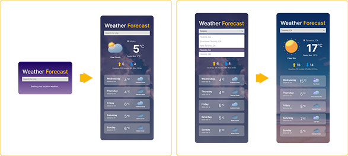

# Weather App

## Overview

This Weather App is built with React and allows users to get current location weather, search for weather by location, and view weather forecasts.

## Features

1. **Get Current Location Weather:** Upon opening the app, users are prompted to allow access to their current location. The app fetches the current weather conditions based on the user's geographical coordinates.
2. **Search Location:** Users can search for weather information in any location by typing the city name or zip code into the search bar. The app retrieves the weather data for the specified location.
3. **Weather Forecast:** The app provides a weather forecast for the upcoming days, allowing users to plan ahead and stay informed about changes in weather conditions.



## API Integration

This app integrates with two APIs:

- **OpenWeatherMap**: Used to fetch weather data based on location and provide weather forecasts.
- **GeoDB Cities**: Used to search for location data such as city, region, country, and island.

## Technologies Used

- React.js: Used for building the user interface and managing state.
- Sass: Used for styling and structuring the components.
- JavaScript (ES6+): Used for implementing logic and handling user interactions.

## Usage

- Upon opening the app, the current location weather is displayed.
- Use the search feature to look up weather by location.
- View the weather forecast for the selected location.

## Weather Display

The weather display in this app includes different weather icons and backgrounds based on the current weather conditions. Here's how it works:

- **Weather Icons**: Weather icons change dynamically based on the current weather condition. Icons include representations of sunny, cloudy, rainy, and other weather conditions.
- **Background Images**: The background of the app changes according to the current weather condition. For example, a sunny background is displayed when the weather is clear, while a cloudy background is shown when the weather is cloudy.

## Setup Instructions

### 1. Obtain API Keys

Before running the application, you need to obtain API keys for the GeoDB Cities API and the OpenWeatherMap API.

- **GeoDB Cities API Key**: Visit the [GeoDB Cities API website](https://rapidapi.com/wirefreethought/api/geodb-cities) and sign up for an account to obtain your API key.
- **OpenWeatherMap API Key**: Sign up for an account on the [OpenWeatherMap website](https://openweathermap.org/) to obtain your API key.

### 2. Set Up Environment Variables

Once you have obtained the API keys, you need to set them up as environment variables in a `.env` file.

1. Create a `.env` file in the root directory of the project.
2. Add the following lines to the `.env` file: replace `YOUR_GEODB_API_KEY_HERE` with your actual GeoDB Cities API key and `YOUR_OPENWEATHER_API_KEY_HERE` with your OpenWeatherMap API key.

### 3. Install Dependencies

Before running the application, install the dependencies using npm or yarn:

```bash
npm install
# or
yarn install
```
